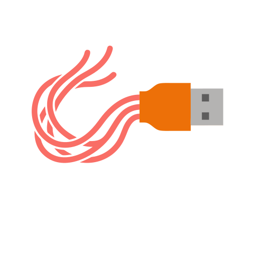

<p align="center">
  
</p>

# Osedax

A cross-platform USB flashing tool written in Rust, targeting **Windows, Linux, and BSD**
with automatic platform detection.

Osedax writes bootable images to USB drives. Rather than shelling out to an existing
flasher, it reimplements the burning logic natively in Rust — taking the hard-won
edge-case handling from mature tools (Rufus, WoeUSB, balenaEtcher) and porting the
*logic* into a clean, testable core.

## Status

Early development. The project is a Cargo workspace:

| Crate        | Purpose                                                    |
| ------------ | --------------------------------------------------------- |
| `osedax-core` | The platform-neutral engine: image detection, device enumeration, safety checks, and the write/verify pipeline. |
| `osedax-cli`  | Command-line frontend.                                    |
| `osedax-gui`  | Graphical frontend (egui). Deferred, but the architecture accommodates it from the start. |

### What works today

- **Image detection.** A pure decision tree that classifies an image head into
  ISO 9660 / UDF, raw disk image (MBR/GPT), bare filesystem, WIM, or a compression
  wrapper — by magic bytes, never by file extension.
- **Hybrid-ISO analysis.** Distinguishes a dd-writable hybrid ISO from an
  optical-only one, and warns before writing an optical-only BSD ISO that would
  not boot from USB.

All detection logic is a pure function of bytes — no device access — and is covered
by unit tests.

## Design notes

- Linux and BSD burning depend on **no external flashing tool**; the logic is native Rust.
- The Windows path (Windows-installer media) reuses the smallest possible set of
  external calls where no mature pure-Rust alternative exists (e.g. NTFS formatting).
- Detection and safety are built and tested before any code that writes to a device.

## Building

```sh
cargo build
cargo test
```

## License

[GPL-3.0-or-later](LICENSE). Osedax ports logic from GPL-3.0 tools (Rufus, WoeUSB,
caligula), so the project as a whole is GPL-3.0. Ideas from MIT (Popsicle) and
Apache-2.0 (balenaEtcher, drivelist) code are compatible with this license.
